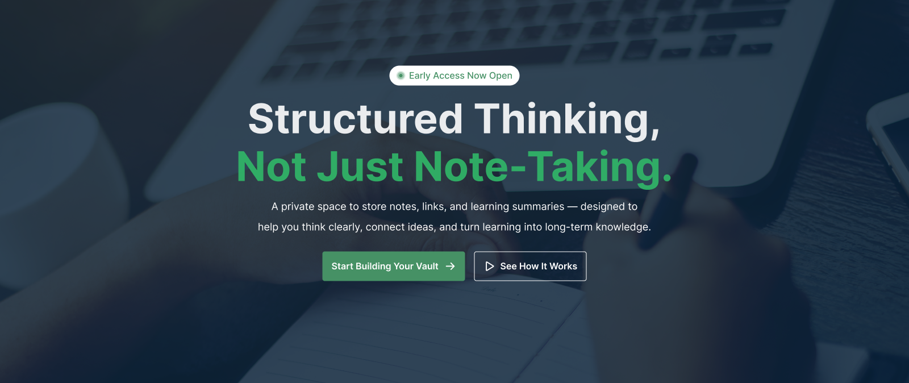

##  Overview
This is a responsive web application built as part of an assignment project.  
The project focuses on clean design, user-friendly interface, and modern web development practices.

##  Technologies Used
- HTML5  
- CSS3  
- JavaScript

##  Features
- Responsive design (Mobile + Desktop)
- Clean and modern UI
- Interactive elements using JavaScript
- Well-structured layout

---

##  Dependencies
This project does not use external libraries or frameworks.  

##  How to Run Locally
Clone the repository: git clone https://github.com/your-username/B13-Assignment-1.git

## Relevant Links
 Live link: https://rakibmur420-source.github.io/B13-Assignment-1/
 
 git repo link: https://github.com/rakibmur420-source?tab=repositories

### 🔹 Screenshort 

